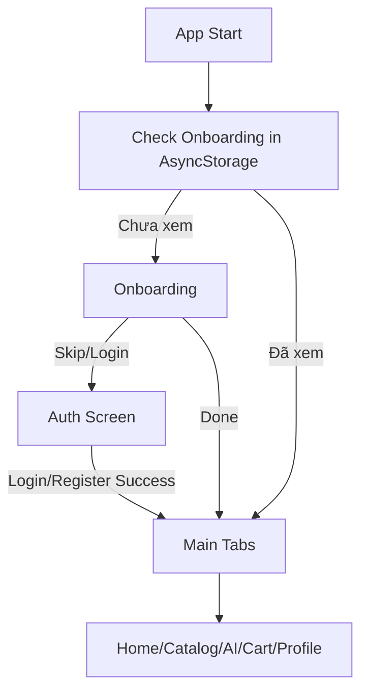
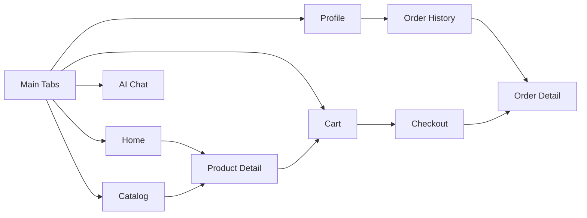
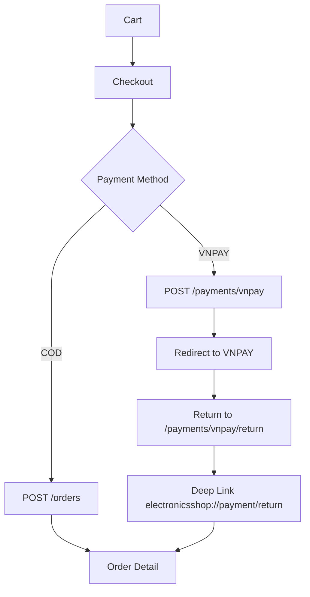
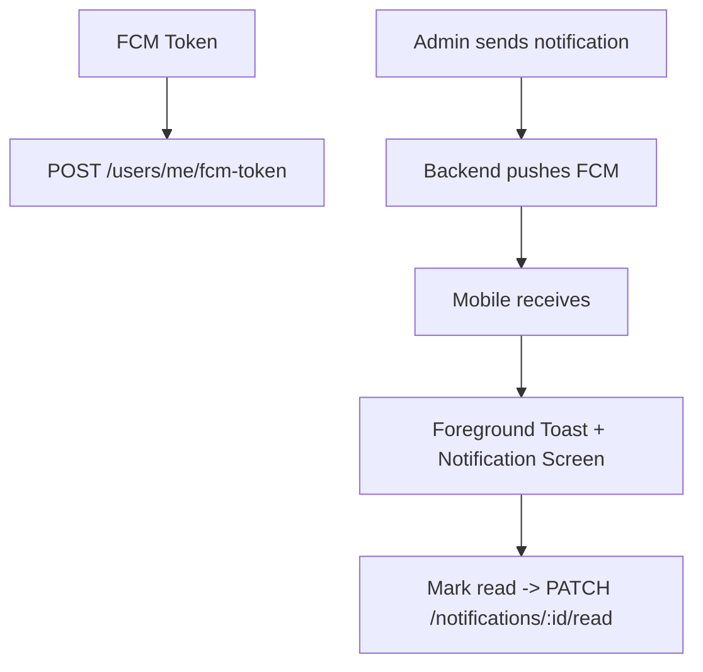

# ElectronicsShop Mobile App

Ứng dụng mobile cho khách hàng của hệ thống ElectronicsShop. Đây là client chính để duyệt sản phẩm, đặt hàng, thanh toán và nhận thông báo realtime.

## Tổng quan kiến trúc
- React Native + React Navigation (stack + tab + custom animated tab bar)
- State: Context Providers (auth, cart, orders, notifications, AI chat)
- Data fetching: TanStack Query
- Realtime: Socket.IO
- Push: Firebase Cloud Messaging
- UI: NativeWind + custom theme

## Cấu trúc thư mục (tóm tắt)
- `src/screens` các màn hình chính
- `src/components` UI components
- `src/navigation` stack/tab, layout, animated tab bar
- `src/context` state quản lý app
- `src/services` API, socket, FCM
- `src/utils` helpers
- `src/theme` theme tokens

## Cấu hình môi trường
Tạo `.env` trong thư mục này:

```env
API_BASE_URL=http://localhost:3000
# Dành cho thiết bị thật: dùng IP LAN của máy chạy backend
API_DEVICE_HOST=http://192.168.1.15:3000
APP_LINK_DOMAIN=electronicsshop.app
APP_LINK_SCHEME=electronicsshop
```

## Cài đặt
```bash
npm install
```

## Chạy ứng dụng
```bash
npm run start

# Android
npm run android

# iOS
npm run ios
```

## Flow tổng thể (App)


## Flow điều hướng chính


## Flow đặt hàng + thanh toán


## Flow thông báo (Mobile)


## Liên kết hệ thống
- Backend API: cung cấp dữ liệu sản phẩm, đơn hàng, thanh toán, AI chat
- Admin Web: cập nhật sản phẩm, đơn hàng, banner, notification

## Lưu ý triển khai
- Android emulator gọi backend local: dùng `10.0.2.2` hoặc cấu hình `API_DEVICE_HOST`.
- Sau thay đổi native module: clean & rebuild app.

## Liên quan
- Tổng quan hệ thống: `/Users/levanduy/Nam4/HK2/Mobile/ElectroAI/readme.md`
- Backend: `/Users/levanduy/Nam4/HK2/Mobile/ElectroAI/electronics-backend/README.md`
- Admin: `/Users/levanduy/Nam4/HK2/Mobile/ElectroAI/electronics-admin/README.md`
