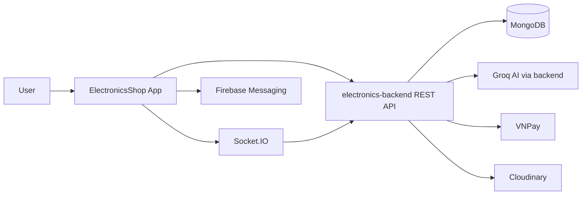
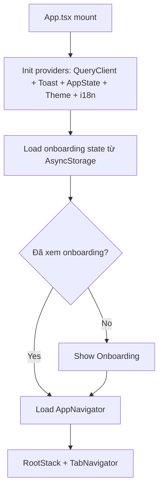
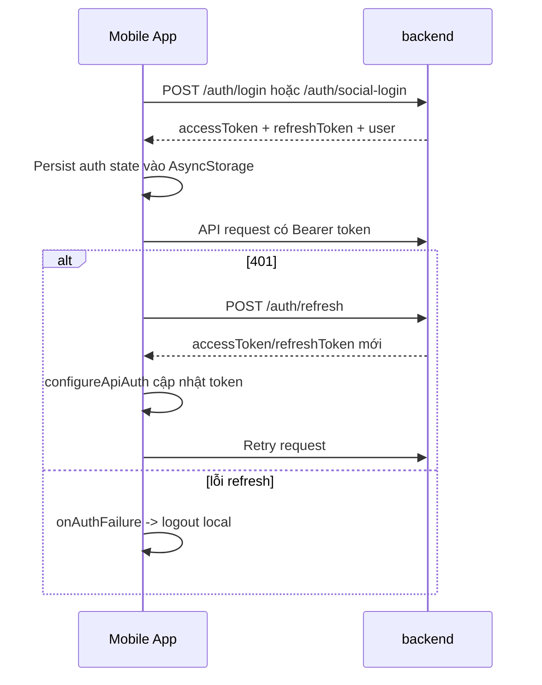
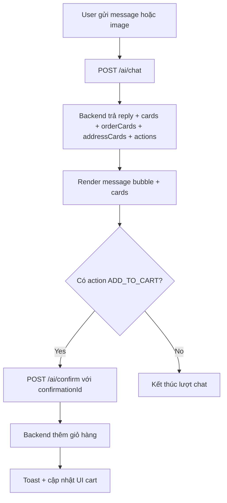

# ElectronicsShop

Ứng dụng mobile thương mại điện tử cho linh kiện điện tử, tích hợp AI chat tư vấn sản phẩm, theo dõi đơn hàng và thanh toán VNPAY.

- Platform: React Native (Android + iOS)
- App client của hệ sinh thái `electronics-backend` + `electronics-admin`

## 1. Tính năng chính

- Mua sắm sản phẩm linh kiện: danh mục, tìm kiếm, lọc, chi tiết, đánh giá.
- Giỏ hàng đồng bộ theo tài khoản (và fallback local khi chưa đăng nhập).
- Checkout với 2 phương thức: `COD` và `VNPAY`.
- Quản lý đơn hàng: lịch sử đơn, chi tiết đơn, timeline trạng thái.
- AI Chat:
  - Chat tư vấn linh kiện theo ngữ cảnh.
  - Hỗ trợ gửi ảnh (sơ đồ mạch/linh kiện) để AI phân tích.
  - Trả về product cards + actions (ví dụ thêm giỏ hàng có xác nhận).
  - Lưu history và archives cuộc hội thoại.
- Auth đầy đủ: login, register OTP email, quên mật khẩu, đổi mật khẩu, social login Google/Apple.
- Hồ sơ người dùng: cập nhật profile/avatar, địa chỉ giao hàng, wishlist, voucher.
- Notifications qua Firebase Cloud Messaging (FCM).
- i18n: Tiếng Việt/Tiếng Anh.
- Theme mode: `light`, `dark`, `system`.
- Biometric lock (Face ID / Touch ID / Biometrics).

## 2. Kiến trúc ứng dụng



## 3. Stack công nghệ

- `React Native 0.83.1`
- `React 19`
- `TypeScript`
- `React Navigation` (Native Stack + Bottom Tabs)
- `@tanstack/react-query`
- `AsyncStorage`
- `socket.io-client`
- `@react-native-firebase` (app/auth/messaging)
- `@react-native-google-signin/google-signin`
- `@invertase/react-native-apple-authentication`
- `react-hook-form` + `zod`
- `nativewind`

## 4. Cấu trúc thư mục

```text
ElectronicsShop/
├── src/
│   ├── components/           # UI components theo domain (auth/cart/ai/home/profile/...)
│   ├── screens/              # Màn hình chính
│   ├── navigation/           # RootStack + TabNavigator + tab screens
│   ├── context/              # AppStateProvider + AppContext (state trung tâm)
│   ├── services/             # API, FCM, Socket, Biometric, Prefetch
│   ├── hooks/                # useCatalogQueries, ...
│   ├── theme/                # light/dark theme + typography
│   ├── i18n/                 # vi/en locale
│   ├── utils/                # cache, mappers, filter, network, ...
│   ├── constants/            # constants và dữ liệu mặc định
│   └── types/                # model types
├── android/
├── ios/
├── App.tsx
└── package.json
```

## 5. Điều hướng (Navigation)

Bottom tabs (`TabNavigator`):
- `HomeTab`
- `CatalogTab`
- `AITab`
- `CartTab`
- `ProfileTab`

Root stack (`RootStack`) chứa màn chi tiết/flow:
- `ProductDetail`, `Search`, `Filter`, `Notifications`, `AIChatHistory`
- `Checkout`, `OrderDetail`
- `Auth`, `Settings`, `OrderHistory`, `AddressBook`, `Wishlist`, `SupportCenter`, `ChangePassword`, `LanguageSelection`, `AdminAddProduct`

## 6. Luồng runtime chính

### 6.1 App startup



### 6.2 Auth + refresh token



### 6.3 AI chat + action confirm



## 7. Quản lý state và dữ liệu

`AppStateProvider` là trung tâm state của app:
- Auth state: `isLoggedIn`, `authTokens`, `userProfile`, `userRole`.
- Product/catalog state + filters + search query.
- Cart state, order state, notification state, vouchers, addresses.
- AI chat messages + archive + sync local/remote.
- Theme mode, push setting, biometric lock state.

Dữ liệu server dùng kết hợp:
- `react-query` (query/mutation + invalidation).
- Polling có điều kiện cho orders/notifications.
- Socket `db_change` để refresh dữ liệu quan trọng theo thời gian thực.
- Cache local qua `cacheManager` (`AsyncStorage` + memory cache).

## 8. Môi trường (`.env`)

Copy mẫu:

```bash
cp .env.example .env
```

Các biến dùng trong app:

```env
API_BASE_URL=http://localhost:3000
API_DEVICE_HOST=http://192.168.x.x:3000
APP_LINK_DOMAIN=electronicsshop.app
APP_LINK_SCHEME=electronicsshop
GOOGLE_WEB_CLIENT_ID=your_google_web_client_id
```

Ghi chú:
- `API_BASE_URL` có thể để localhost khi chạy simulator.
- Với máy thật, đặt `API_DEVICE_HOST` thành IP LAN của máy chạy backend.
- `GOOGLE_WEB_CLIENT_ID` dùng cho Google Sign-In + Firebase auth flow.

## 9. Tích hợp backend (API chính)

Các nhóm endpoint được dùng trong `src/services/api.ts`:

- Catalog: `/products`, `/products/:id`, `/products/:id/related`, `/banners/public`
- Auth: `/auth/login`, `/auth/social-login`, OTP register/reset/change password, `/auth/refresh`
- User profile: `/users/me`, `/users/me/favorites`, `/users/me/addresses`, `/users/me/fcm-token`
- Cart/Order/Payment: `/carts`, `/carts/items`, `/orders`, `/orders/:id`, `/payments/vnpay`
- AI: `/ai/chat`, `/ai/confirm`, ai chat history/archives qua `/users/me/ai-chat-*`
- Notifications: `/notifications`, `/notifications/:id/read`, `/notifications/read-all`
- Search trends/history: `/search-trends`, `/search-trends/increment`, `/users/me/search-history`

## 10. Firebase và social login

Yêu cầu file native:
- Android: `android/app/google-services.json`
- iOS: `ios/ElectronicsShop/GoogleService-Info.plist`

Google login:
- App dùng Google Sign-In để lấy token.
- Token được xác thực qua Firebase Auth client.
- Firebase ID token được gửi tới backend `/auth/social-login`.

Apple login:
- Dùng `@invertase/react-native-apple-authentication`.
- Tạo credential Firebase, rồi gọi backend `/auth/social-login` với provider `apple`.

FCM:
- Xin quyền notification, lấy token, sync token lên backend.
- Lắng nghe foreground message để hiển thị toast.

## 11. Checkout và VNPAY

- `Checkout` tạo payload order từ cart items + địa chỉ + payment method.
- Nếu `COD`: tạo đơn trực tiếp qua `/orders`.
- Nếu `VNPAY`: gọi `/payments/vnpay`, mở `paymentUrl`, app polling trạng thái đơn và check lại khi app active.

## 12. Biometric lock

- Toggle ở Settings.
- Trạng thái lưu ở `AsyncStorage` (`biometric_lock_enabled`).
- Khi app về background/inactive và biometric bật, app lock lại.
- Khi quay về foreground, người dùng cần xác thực để mở khóa.

## 13. Cài đặt và chạy

### 13.1 Yêu cầu

- Node.js `>= 20`
- JDK + Android Studio (Android)
- Xcode + CocoaPods (iOS, macOS)

### 13.2 Install

```bash
cd ElectronicsShop
npm install
```

### 13.3 iOS pods (macOS)

```bash
cd ios
pod install
cd ..
```

### 13.4 Run

```bash
npm start
```

Terminal khác:

```bash
npm run android
# hoặc
npm run ios
```

## 14. Scripts

- `npm start`: chạy Metro bundler
- `npm run android`: build/run Android
- `npm run android:clean`: clean gradle + cache plugin RN
- `npm run ios`: build/run iOS
- `npm run lint`: ESLint
- `npm test`: Jest

## 15. Android local.properties

Nếu thiếu Android SDK path, copy file mẫu:

- `android/local.properties.example` -> `android/local.properties`
- cập nhật `sdk.dir=...` theo máy local

## 16. Troubleshooting nhanh

- App không gọi được backend trên máy thật:
  - kiểm tra `API_DEVICE_HOST`
  - backend có mở cổng `3000` trong cùng mạng LAN
- Lỗi social login:
  - kiểm tra `GOOGLE_WEB_CLIENT_ID`
  - kiểm tra file Firebase config native
- Không nhận notification:
  - kiểm tra permission OS
  - kiểm tra FCM token đã sync backend
- VNPAY không quay lại app:
  - kiểm tra `APP_LINK_SCHEME` và cấu hình deep link native
- Socket không nhận update:
  - kiểm tra backend socket CORS/JWT

## 17. Bảo mật

- Không commit `.env`, file Firebase config, keystore/signing keys.
- Token auth được lưu local, tự refresh qua `/auth/refresh`.
- Khi refresh thất bại, app clear session và yêu cầu đăng nhập lại.

## 18. License

UNLICENSED.
